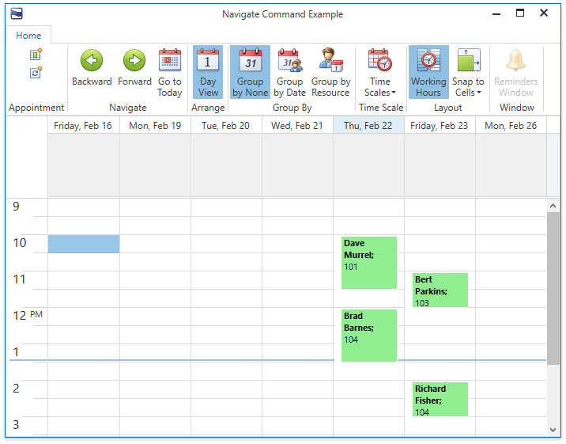

<!-- default badges list -->

<!-- default badges end -->

# WPF Scheduler - Hide Non-Working Days in the Day View

This example hides non-working days (Saturday and Sunday) from the [Day View](https://docs.devexpress.com/WPF/119204/controls-and-libraries/scheduler/views/day-view) and does not allow users to navigate to these days.

## Implementation Details

1. Specify the [DayView.Days](https://docs.devexpress.com/WPF/DevExpress.Xpf.Scheduling.DayView.Days) property to display a custom set of days.

2. Process the following user navigation types:

   * Left and right arrow keys — Attach the [KeyToCommand](https://docs.devexpress.com/WPF/DevExpress.Mvvm.UI.KeyToCommand) behavior to the Scheduler.
   * UI navigation — Use the [SchedulerControl.Commands](https://docs.devexpress.com/WPF/DevExpress.Xpf.Scheduling.SchedulerControl.Commands) property to replace default commands executed when a user uses the Scheduler UI for navigation.

3. Handle the [SchedulerControl.VisibleIntervalsChanged](https://docs.devexpress.com/WPF/DevExpress.Xpf.Scheduling.SchedulerControl.VisibleIntervalsChanged) event to adjust visible dates when visible view intervals are changed.

## Files to Review

* [MainWindow.xaml](./CS/NavigateCommandExample/MainWindow.xaml)
* [MainViewModel.cs](./CS/NavigateCommandExample/ViewModel/MainViewModel.cs) (VB: [MainViewModel.vb](./VB/NavigateCommandExample/ViewModel/MainViewModel.vb))

## Documentation

* [Day View](https://docs.devexpress.com/WPF/119204/controls-and-libraries/scheduler/views/day-view)
* [Navigation](https://docs.devexpress.com/WPF/119418/controls-and-libraries/scheduler/navigation)
* [SchedulerControl.VisibleIntervalsChanged](https://docs.devexpress.com/WPF/DevExpress.Xpf.Scheduling.SchedulerControl.VisibleIntervalsChanged)
<!-- feedback -->
## Does this example address your development requirements/objectives?

 

(you will be redirected to DevExpress.com to submit your response)
<!-- feedback end -->
